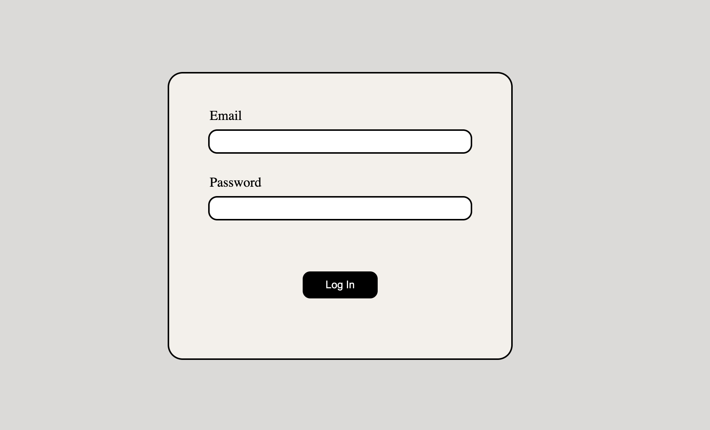

# MODULE-1-PART-3-gallery #

MODULE-1-PART-3-gallery - it's a simple gallery with pictures of cute and funny animals :)

## Project Status ##

In progress

## Technologies ##

* HTML5
* CSS3
* JavaScript

## Usage ##

1. You have to log in. After filling the fields in click log in button to get your token

2. You can navigate through pages using this simple links bar

3. Enjoy!

## Authors and contacts ##

``name``: Kirill Temnyi
``email``: [kirik201100@gmail.com](mailto:kirik201100@gmail.com)

